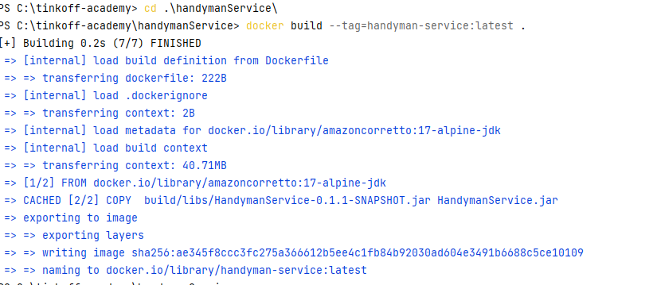
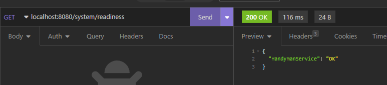
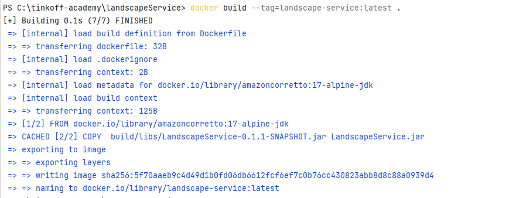
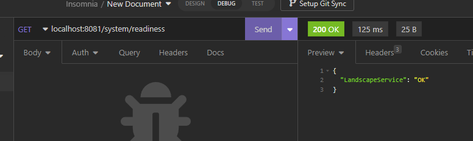
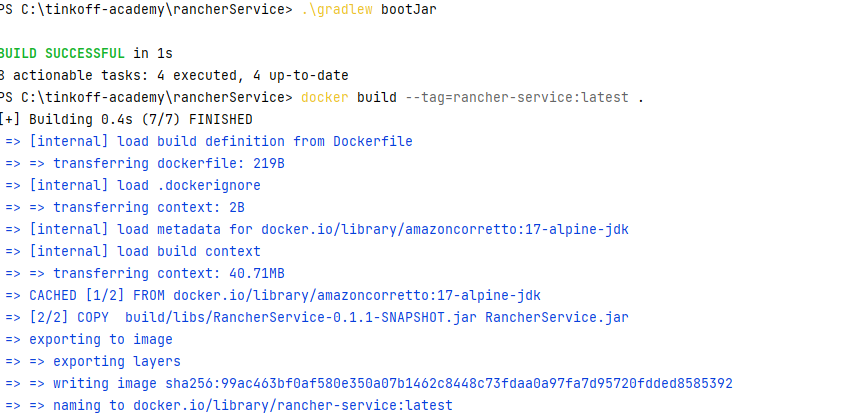
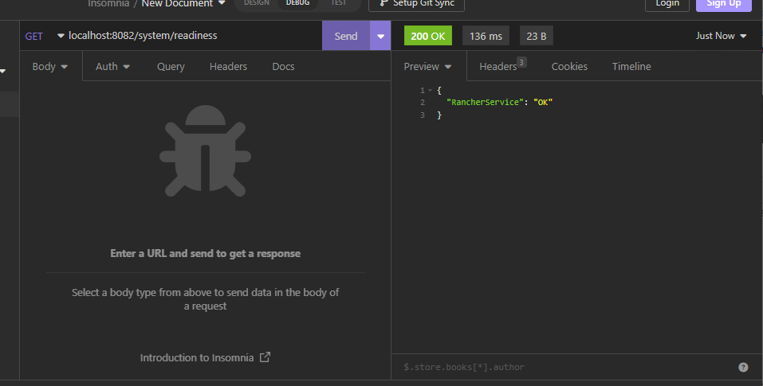
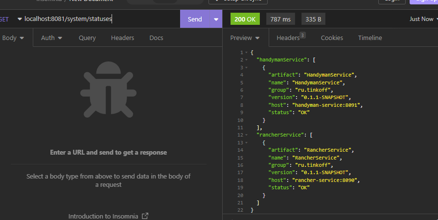

## handymanService
1) перейти в директорию сервиса.
3) выполнить команду `docker build --tag=handyman-service:latest .`

4) выполнить команду `docker run  -p 8080:8080 -p 8091:8091 handyman-service`
5) Пример работы 

## landscapeService
1) перейти в директорию сервиса.
3) выполнить команду `docker build --tag=landscape-service:latest .`

4) выполнить команду `docker run  -p 8081:8081 landscape-service`
5) Пример работы 

## rancherService
1) перейти в директорию сервиса.
3) выполнить команду `docker build --tag=rancher-service:latest .`

4) выполнить команду `docker run  -p 8082:8082 -p 8090:8090 rancher-service`
5) Пример работы 

## Запуск всего сразу
1) запусить команду `docker-compose up --build`

## Запуск через minicube 
1) выполнить команду `minikube start`
2) выполнить команду `kubectl apply -f .\kubernetes-config\`
3) выполнить команду `minikube service service-name --url`, где `service-name` имя необходимого сервиса.
4) По окончанию работ выполнить комадну `kubectl delete all --all`.
5) Остановить minikube командой `minikube stop`

## Запуск grafana
1) Открыть в браузере `http://localhost:3000`
2) Ввести логин и пароль из docker-compose файла
3) Установить источник данных `http://prometheus:9090`
4) Импортировать dashboard из json файла